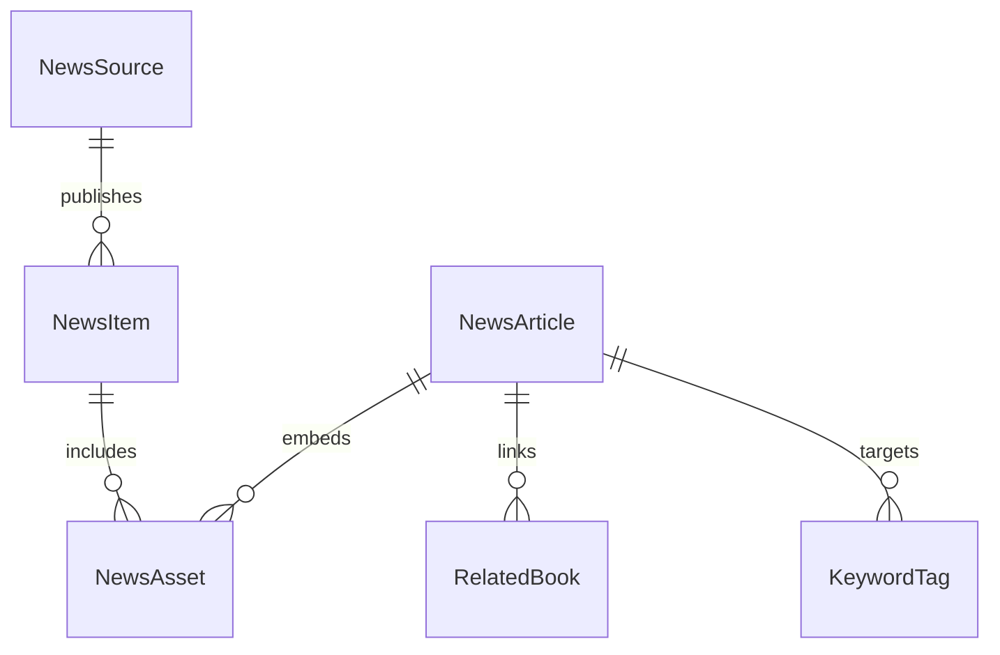

# Scottish Aviation News Pipeline – Schema & Storage Plan

## 1. Core Entities



### `NewsSource`
| Field | Type | Notes |
| --- | --- | --- |
| `id` | string (slug) | e.g., `raf-mod-uk` |
| `name` | string | Human-readable |
| `type` | enum (`primary`, `secondary`, `archival`) |
| `mode` | enum (`rss`, `govuk-content-api`, `wordpress-json`) | Controls which fetch/parser logic runs |
| `feedUrl` | string | RSS/Atom endpoint (for `rss` sources) |
| `apiUrl` | string | JSON endpoint (for API-driven sources) |
| `siteUrl` | string | Optional base URL for canonical links |
| `licence` | enum (`ogl`, `corporate`, `restricted`) |
| `attribution` | string | Required credit line |
| `imagePolicy` | enum (`crown`, `cc`, `restricted`) |
| `notes` | string | e.g., “Photos require MOD credit” |

Stored in `data/news-sources.json` (tracked).

### `NewsItem` (raw ingestion)
| Field | Type | Notes |
| --- | --- | --- |
| `sourceId` | string (FK to `NewsSource`) |
| `sourceUrl` | string | Canonical article URL |
| `guid` | string | Feed GUID/ID for dedupe |
| `title` | string |
| `summary` | string | Short excerpt from feed |
| `publishedAt` | ISO timestamp (UTC) |
| `fetchedAt` | ISO timestamp |
| `categories` | string[] | Tags from source |
| `licence` | enum | Derived from source |
| `media` | `NewsAsset[]` | Images/videos metadata |
| `status` | enum (`new`, `queued`, `drafted`, `published`, `archived`) |

Persisted in `data/news-ingest-log.json` (append-only history) plus `data/news-queue.json` (active items). Both tracked via git for transparency; `news-ingest-log` may grow large—consider splitting monthly.

### `NewsAsset`
| Field | Type | Notes |
| --- | --- | --- |
| `url` | string | Original media URL |
| `type` | enum (`image`, `video`, `audio`) |
| `caption` | string |
| `credit` | string |
| `licence` | enum |
| `localPath` | string | Filled once downloaded (e.g., `/public/blog-images/...`) |
| `approvalStatus` | enum (`pending`, `approved`, `rejected`) |

### `NewsArticle` (generated blog post)
| Field | Type | Notes |
| --- | --- | --- |
| `slug` | string | `/blog/scottish-aviation-news/<date>-<slug>` |
| `title` | string |
| `wordCount` | number | Must be ≥ 3000 |
| `sections` | array of `{ heading, content }` |
| `images` | array referencing `NewsAsset` (with local paths) |
| `sourceReferences` | array of `{ sourceId, sourceUrl, citationText }` |
| `relatedBooks` | array of `RelatedBook` |
| `keywords` | array of `KeywordTag` |
| `status` | enum (`draft`, `needs-review`, `approved`, `published`) |
| `createdAt` | ISO timestamp |
| `publishedAt` | ISO timestamp |

`Quote`/`Reference` metadata ensures we can audit factual citations.

### `RelatedBook`
| Field | Type |
| --- | --- |
| `bookId` | string (matches `books.ts` id) |
| `reason` | string (why this book links to article) |

### `KeywordTag`
| Field | Type | Notes |
| --- | --- | --- |
| `keyword` | string | Target SEO phrase |
| `primary` | boolean | True for the main focus term |

## 2. File & Storage Layout

```
data/
  news-sources.json               # authoritative source list
  news-ingest-log.json            # append-only ingestion history
  news-queue.json                 # items awaiting drafting
  news-articles/
    2025/
      11/
        2025-11-21-lossiemouth-ops.json   # draft metadata per article
  keyword-rankings/
    2025-11-21.json                # daily SERP snapshot (future task)
scripts/
  news-ingest.cjs                  # fetch feeds, populate queue
  news-draft.cjs                   # build 3k-word article skeleton + images
  news-publish.cjs                 # convert JSON draft to Next.js MDX/TSX
```

- Article JSON files serve as the source of truth for generated TSX content (similar to how `books.ts` drives Bookinfo). They include structured sections, references, and asset references.
- Git history provides auditing; sensitive API keys (if needed) go in `.env.local`.

## 3. Processing Flow

1. **Ingestion (`news-ingest.cjs`)**
   - Iterate `news-sources`.
   - Fetch RSS/Atom/JSON (respecting rate limits, ETags).
   - For each entry, derive `guid` and check against `news-ingest-log`.
   - Append new `NewsItem` to log + queue with `status: "new"`.
   - Log errors (per source) to `logs/news-ingest-YYYYMMDD.log`.

2. **Drafting (`news-draft.cjs`)**
   - Pull `news-queue.json`, select items by priority (primary sources first).
   - Combine multiple related `NewsItem`s into a single article if theme-aligned (e.g., multiple RAF sorties).
   - Generate outline (Intro, Technical Analysis, Heritage, Modern Relevance, Book CTA).
   - Fetch/download approved images via `imageManagement` utilities; update `NewsAsset.localPath`.
   - Write article JSON file under `data/news-articles/<yyyy>/<mm>/<slug>.json`.
   - Update queue status to `drafted`.

3. **Publishing**
   - Convert article JSON into TSX page under `src/app/blog/scottish-aviation-news/<slug>/page.tsx` using existing blog template (ensuring TOC, progress bar, UnifiedSchema, EnhancedBookSEO).
   - Run validations: word count ≥3000, ≥4 images with captions, references present.
   - On success, mark `news-queue` entry `published`.

4. **Archiving & Cleanup**
   - Rotate `news-ingest-log` monthly.
   - Archive processed queue entries > 30 days old.

## 4. Metadata & Validation Rules

- **Word count**: computed by `news-draft` and revalidated on build.
- **Image requirements**: ≥4 approved images, each with descriptive alt + caption + credit.
- **Licensing**: If `licence` is `restricted`, article cannot auto-publish—requires manual approval flag.
- **Source references**: At least one citation per major section; format `“[Source: RAF Press Release, 21 Nov 2025]”`.
- **Book linkage**: Minimum one related book; `news-draft` selects via tag matching (e.g., `Helicopter` → `sycamore-seeds`).

## 5. Future Extensions

- Attach `FactCheck` objects referencing supporting archival documents.
- Persist ingestion metrics (items per source/day) for monitoring.
- Support manual overrides via `news-overrides.json` (e.g., force include/exclude).

